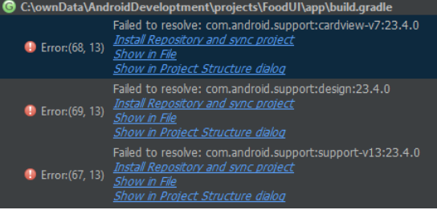

## Info

Author: Vadim Demkiv<br/>
Contact: vadim.demkiv@gmail.com<br/>
Published on: June 12, 2016

## Abstract

This tutorial describes the requirements and necessary steps to get the FoodUI
project working in Android Studio 2.1.2. FoodUI is a university project, which I realized within the master project VR-Lab from the master's degree program Human-Centered Computing at Reutlingen University in 2015/16.
It's an Android app for fruit detection and uses OpenCV for the image processing. The core task of the app is to detect fruits in the live camera frames. To detect fruits, you have to save them first. This learning process is realized with the hsv-mode within the app, which uses normalized hsv color histograms as a feature. There's a demo video available on Youtube: https://youtu.be/KSAPpJUC_74

## 1. Requirements

You need a few components in order to run this project:
* Android Studio 2.1.2:
https://developer.android.com/studio/index.html#downloads
* Android NDK R11c:
https://developer.android.com/ndk/downloads/index.html
* OpenCV 3.1 (for Android):
http://opencv.org/downloads.html
* FoodUI project:
https://github.com/DemkivV/FoodUI
* Disk space for the development tools and projects: 8GB

## 2. Installation

I recommend putting all the files for the android development into a mutual folder - in this tutorial I'll call the folder AndroidDevelopment. In the following explanations I will refer to this folder as a root folder.
Download the different components from the requirements, install Android Studio and extract the content from the Android NDK and OpenCV zip files to the folder AndroidDevelopment. Keep this folder in mind when defining the directory for Android Studio and the Android sdk in the Android Studio installation. Also, write down the path for the Android sdk and the extracted android ndk.
Now create a projects folder in your AndroidDevelopment and copy the FoodUI
project into it.

## 3. Configuration

The next step is to start Android Studio and open the FoodUI project. Change the
value of the sdk.dir parameter and add a ndk.dir parameter and value in the file
local.properties of the FoodUI project. This should be the previously mentioned.
Also please note the spelling.
It could look like this:

```
1 sdk.dir=C\:\\ownData\\AndroidDevelopment\\sdk
2 ndk.dir=C\:\\ownData\\AndroidDevelopment\\android -ndk-r11c
```

Now try to sync the gradles. If something the error in figure 1 appears, click Attempt to install all packages in the popped up mask. Afterwards press the icon Sync Project with Gradle Files to sync all gradle files.

 <br/>
*Figure 1: Example for the errors if repositories are missing.*

Now open the file projects/FoodUI/app/src/main/jni/Android.mk and change the
parameter OPENCVROOT to the path - again, please note the spelling. It's possible,

that the folder jni is not shown in the Android view within Android Studio. In
this case switch to the project view.
It could look like this:

```
OPENCVROOT:= C:\\ownData\\AndroidDevelopment\\OpenCV31-android-sdk
```

Then run the following function from the Android Studio menu in this order:
1. Build/Clean Project
2. Build/Make Project

## 4. Testing the project

Now everything should be configured right and the project is ready to go. Eiter use your own smartphone - therefor you have to activate the developer tools and plug it in - or use the emulator within Android Studio. I tested it on my Sony Xperia Z3 with Android 6.0.1 and it works fine. Currently the settings in the gradles are as follows:

```
minSdkVersion 21
targetSdkVersion 23
```

If you want to run this app on a lower Android version, you have to change these
specifications accordingly to the desired sdk version in all gradle files. Though, keep in mind that the hardware requirements are tough with this implementation, so a modern smartphone is highly recommended.

## 5. Final Word
Thank you for your interest in my project and good luck with your plans. If you
have any questions, dont't hesitate to ask.
